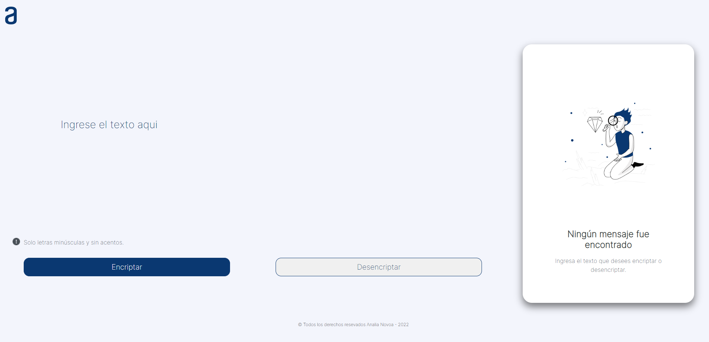

# 🌟 Encriptador con HTML/CSS/JavaScript 🌟

## Alura Latam + Oracle One Challange 1 🏆

**Primer desafío guiado por medio de un Trello y un diseño compartido por Figma. 
En donde desarrolle la lógica de este encriptado que tenia como regla reemplazar las vocales por una palabra asignada a cada una de ellas, 
sin que se sobrescriban y se pueda realizar el desencriptado correspondiente. En cuanto al diseño trate de clonarlo dándole ciertos efectos visuales. 
Esta en proceso de mejoras.**

       

#### ¡Probalo aqui! --> 🔹 [Demo](https://analianovoa.github.io/encriptador)
---
